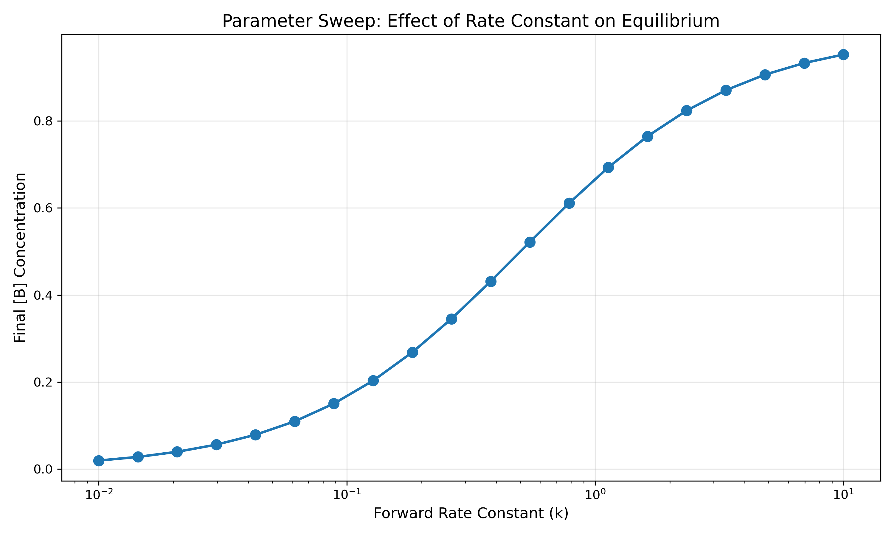

# reaction kinetics playground

plug in reactions, get solutions.



## install

```bash
pip install -e .
```

## use

```python
from kinetics_playground.api import ReactionNetwork

reactions = ["A + B -> C ; 0.1", "C -> A + B ; 0.05"]

network = ReactionNetwork(reactions)
result = network.simulate(
    initial_conditions={"A": 1.0, "B": 1.0, "C": 0.0},
    time_span=(0, 100)
)

result.plot()
```

## features

- text-based reaction input → automatic ODE generation
- symbolic math with sympy
- adaptive numerical integration
- parameter sweeps and visualization
- export to sbml, latex, matlab

## docs

see `docs/` for full documentation.

---

*murari ambati, 2025*
